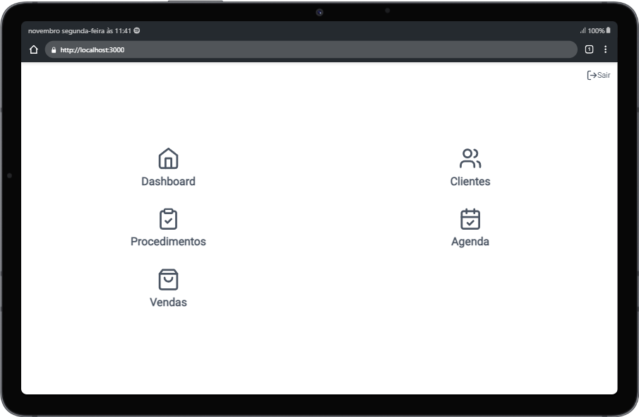

# Sistema de gestão de Clinica de estética

Este projeto corresponde ao front-end de uma aplicação de gestão para uma clínica de estética, oferecendo funcionalidades abrangentes para gerenciamento de clientes, agenda de atendimentos, venda de procedimentos e gestão financeira..

## Índices

- [Sistema de gestão de Clinica de estética](#sistema-de-gestão-de-clinica-de-estética)
  - [Índices](#índices)
  - [Funcionalidades do projeto](#funcionalidades-do-projeto)
  - [Telas do sistema](#telas-do-sistema)
  - [Como rodar o projeto](#como-rodar-o-projeto)
  - [Técnologias utilizadas](#técnologias-utilizadas)
  - [Autores](#autores)
  - [Próximos passos](#próximos-passos)
## Funcionalidades do projeto

- [x] Cadastro de clientes
- [x] Criação de procedimentos
- [x] Agendamento de sessões
- [x] Venda de procedimentos e protocolos estéticos

## Telas do sistema

Menu inicial do sistema:

Tela de listagem de clientes:

Tela de informações específicas do cliente:

Tela de criação de procedimentos:

Agenda de atendimentos:

Tela de venda de serviços:


## Como rodar o projeto

```bash
#installation
npm install

npm run dev
# or
yarn dev
# or
pnpm dev
```

Abra [http://localhost:3000](http://localhost:3000) no seu navegador.

## Técnologias utilizadas

 1. [React JS](https://pt-br.legacy.reactjs.org/)
 2. [Typescript](https://www.typescriptlang.org/)
 3. [Next.JS](https://nextjs.org/)
 4. [React Hook Form](https://react-hook-form.com/)
 5. [Zod](https://zod.dev/)
 6. [Graphql](https://graphql.org/)

## Autores

- [Renan França da Costa](https://www.linkedin.com/in/renan-fran%C3%A7a-da-costa-27b49a187/)

## Próximos passos

- [ ] Gráficos estatisticos no dashboard
- [ ] Gestão de anamneses dos clientes
